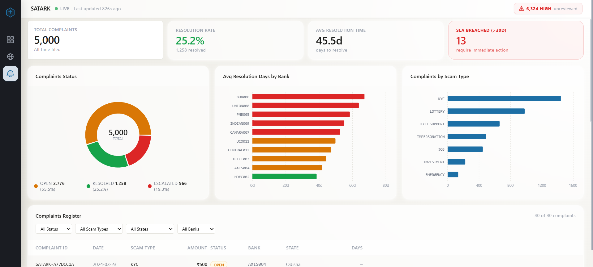
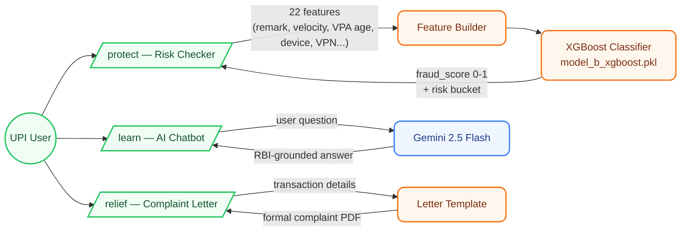
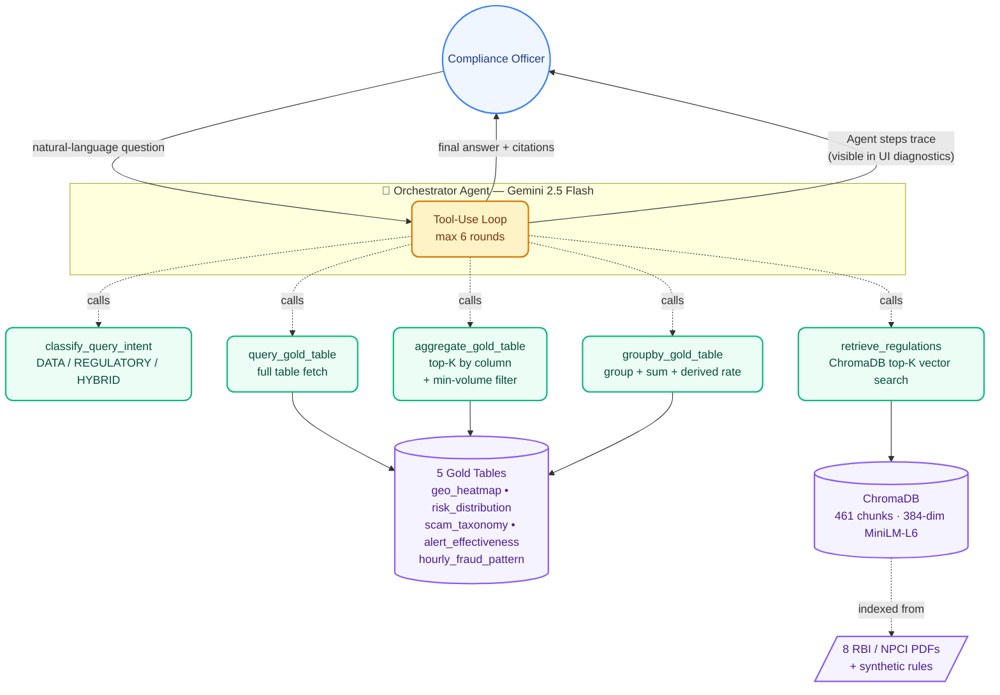

# 🛡️ SATARK: End-to-End UPI Fraud Intelligence

**SATARK** (सर्तक — *Vigilant*) is a two-sided AI platform built for the **Bharat Bricks Hackathon 2026 (IIT Bombay × Databricks)**. It tackles UPI fraud from both ends of the system: **regulators** monitoring 150,000+ transactions and 5,000+ complaints, and **end users** trying to avoid being scammed in real time.



---

## 🧭 What's in this monorepo

This repository unifies the two halves of SATARK that were originally developed in parallel:

| App | Audience | What it does |
|-----|----------|--------------|
| [`apps/compliance-dashboard/`](apps/compliance-dashboard/) | RBI / bank compliance officers | Live analytics dashboard + **tool-using multi-agent system** over RBI Master Directions and 5 gold tables, powered by Gemini 2.5 Flash |
| [`apps/consumer-protect/`](apps/consumer-protect/) | UPI end users | Real-time **XGBoost** risk scoring (22 features), AI fraud-education chatbot, and auto-generated bank complaint letters |

Each app is independently runnable. See [Running Locally](#-running-locally) below.

---

## 🚀 The Big Picture

Indian digital payments suffer from a **compliance lag**: fraud happens at the user, complaints flow to banks, and regulatory action depends on slow manual aggregation. SATARK closes the loop on both sides.

### 1. Consumer side — pre-fraud (Protect) and post-fraud (Relief)



### 2. Regulator side — multi-agent RAG over data + regulations

The compliance dashboard runs a **tool-using orchestrator agent** on every chat question. The orchestrator (Gemini 2.5 Flash) reasons step-by-step and calls five specialised tool-agents in whatever order it needs:



**Why this matters:** each tool result feeds back into the agent's next decision. The agent independently decides — *for this question, do I need to look at the scam taxonomy table, the regulations, or both?* — and grounds every number in its answer in actual table rows + retrieved chunks. No hallucinated stats.

### How the two halves complement each other
- **Consumer Protect** stops fraud at the source (pre-transaction ML scoring + post-incident remediation).
- **Compliance Dashboard** turns the resulting transaction & complaint stream into regulatory action grounded in actual RBI directions.
- Both halves share the same **synthetic dataset** (150K transactions, 5K complaints) and the same **RBI corpus** (8 Master Directions + NPCI circulars).

---

## 🗂️ Repository Layout

```
satark/
├── apps/
│   ├── compliance-dashboard/   # Next.js + FastAPI multi-agent dashboard for regulators
│   │   ├── app/                # Next.js app router pages
│   │   ├── components/         # React UI (charts, chat panel, diagnostics)
│   │   └── backend/
│   │       ├── agents/         # orchestrator + 4 tool implementations
│   │       ├── data/           # gold tables CSV + RBI PDFs
│   │       ├── vectorstore/    # ChromaDB persistent store
│   │       ├── main.py         # FastAPI: /api/chat (SSE), /api/health
│   │       └── setup_rag.py    # one-time PDF → Chroma indexer
│   └── consumer-protect/       # Next.js + FastAPI/XGBoost app for end users
│       ├── web/                # Next.js frontend (Protect / Learn / Relief)
│       └── backend/artifacts/  # XGBoost .pkl + feature_metadata.json
├── docs/
│   ├── interview-prep.md       # walkthrough, FAQs, weak spots
│   └── screenshots/
└── README.md
```

---

## ⚙️ Running Locally

Pick the half you want to run — each is fully self-contained. **Both apps default to ports `:3000` and `:8000`, so run one half at a time.**

### Prerequisites
- Python 3.10+ (project tested on 3.12)
- Node.js 18+
- A `GEMINI_API_KEY` (get one at <https://aistudio.google.com/apikey>)

### Compliance Dashboard
```bash
# Backend — terminal 1
cd apps/compliance-dashboard/backend
python -m venv venv && ./venv/Scripts/activate     # Windows (bash)
# source venv/bin/activate                         # macOS / Linux
pip install -r ../requirements.txt
echo "GEMINI_API_KEY=your_key_here" > .env

# one-time: index the 8 RBI PDFs + CSV summaries into ChromaDB (~30s)
python setup_rag.py

# start FastAPI on :8000
python main.py

# Frontend — terminal 2
cd apps/compliance-dashboard
npm install
npm run dev                                        # http://localhost:3000
```

**Verify**: hit the chat with *"Which 3 states have the worst fraud rates, and what do RBI rules say about regions with sustained high fraud?"* — expand the *Analysis Diagnostics* panel on the bot's reply. The agent should show a step trace (Classifying → Computing top results from the geo_heatmap table → Checking the RBI and NPCI regulatory corpus) with `2` tables indexed and 2+ regulatory sources cited.

### Consumer Protect
```bash
# ML service — terminal 1
cd apps/consumer-protect
python -m venv .venv && ./.venv/Scripts/activate   # Windows (bash)
pip install -r requirements.txt
cd backend/artifacts
python fraud_detector.py                           # :8000

# Frontend — terminal 2
cd apps/consumer-protect/web
npm install
echo "GEMINI_API_KEY=your_key_here" > .env.local
npm run dev                                        # http://localhost:3000
```

**Verify**: on `/protect`, click the "KYC Scam" demo scenario and hit *Check Risk* — risk score should be ≥0.95 (critical bucket).

---

## 🛠️ Tech Stack

| Layer | Compliance Dashboard | Consumer Protect |
|-------|----------------------|------------------|
| Frontend | Next.js 14, Tailwind, Recharts | Next.js, Tailwind |
| Backend | FastAPI, ChromaDB, sentence-transformers (`all-MiniLM-L6-v2`, 384-dim) | FastAPI, XGBoost, scikit-learn, ONNX |
| Agent | Gemini 2.5 Flash with function-calling tool loop | Gemini 2.5 Flash (chatbot only) |
| Data source | 5 gold tables (CSV) + 8 RBI / NPCI PDFs | Synthetic UPI transactions |
| Vector store | Chroma persistent (461 indexed chunks) | n/a |

---

## 📊 Dataset Reference
- **150,031 transactions** across 28 Indian states (Northeast focus for high-risk detection)
- **7 scam categories** (KYC, Investment, Job, Lottery, Impersonation, Tech-Support, Emergency)
- **3 rule-based risk tiers** (High / Medium / Low) used during data generation
- **5,000+ complaints** with real-time SLA / TAT monitoring per RBI guidelines
- **8 regulatory PDFs** indexed: 3 RBI Master Directions, 3 NPCI circulars, 1 CERT-In advisory, 1 RBI annual report

---

## 👥 Team

- Rishabh
- Neepun
- Dhruva
- Dhruv

---

## ⚖️ License
Built for the **Bharat Bricks Hackathon 2026**. All rights reserved.
