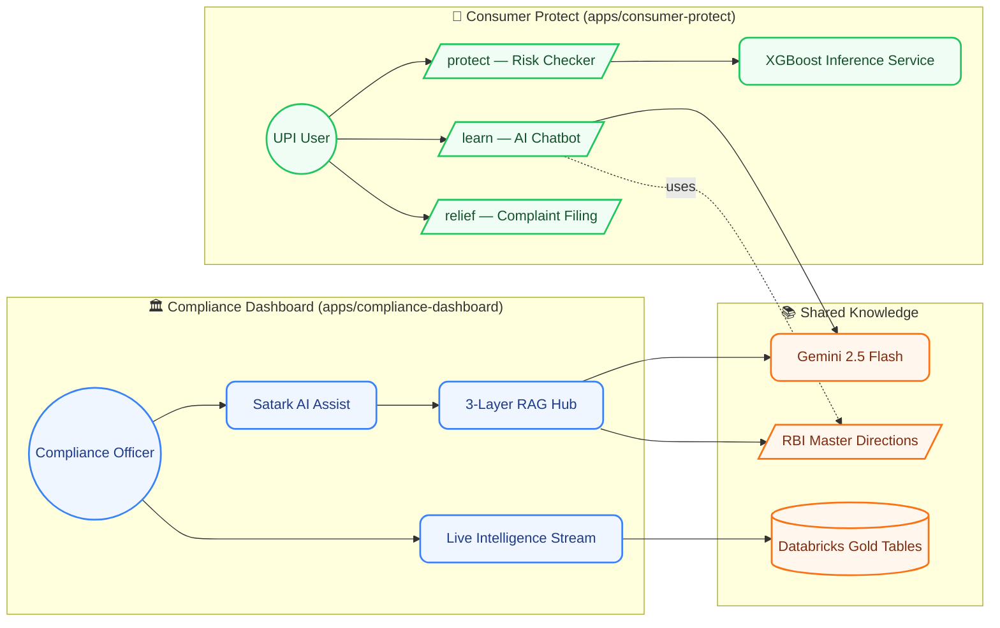

# 🛡️ SATARK: End-to-End UPI Fraud Intelligence

**SATARK** (सर्तक — *Vigilant*) is a two-sided AI platform built for the **Bharat Bricks Hackathon 2026 (IIT Bombay × Databricks)**. It tackles UPI fraud from both ends of the system: **regulators** monitoring 150,000+ transactions and 5,000+ complaints, and **end users** trying to avoid being scammed in real time.


---

## 🧭 What's in this monorepo

This repository unifies the two halves of SATARK that were originally developed in parallel:

| App | Audience | What it does |
|-----|----------|--------------|
| [`apps/compliance-dashboard/`](apps/compliance-dashboard/) | RBI / bank compliance officers | Live analytics dashboard + 3-layer RAG over RBI Master Directions, powered by Gemini 2.5 Flash |
| [`apps/consumer-protect/`](apps/consumer-protect/) | UPI end users | Real-time XGBoost risk scoring, AI fraud-education chatbot, and auto-generated bank complaint letters |

Each app is independently runnable. See the per-app READMEs for setup details:
- [Compliance Dashboard README](apps/compliance-dashboard/README.md) *(if present, otherwise see "Running Locally" below)*
- [Consumer Protect README](apps/consumer-protect/README.md)

---

## 🚀 The Big Picture

Indian digital payments suffer from a **compliance lag**: fraud happens at the user, complaints flow to banks, and regulatory action depends on slow manual aggregation. SATARK closes the loop on both sides.



### How the two halves complement each other
- **Consumer Protect** stops fraud at the source (pre-transaction risk + post-incident remediation).
- **Compliance Dashboard** turns the resulting transaction & complaint stream into regulatory action grounded in actual RBI directions.
- Both halves share the same **synthetic dataset** (150K transactions, 5K complaints) and the same **RBI corpus** (8+ Master Directions).

---

## 🗂️ Repository Layout

```
satark/
├── apps/
│   ├── compliance-dashboard/   # Next.js + FastAPI/RAG dashboard for regulators
│   └── consumer-protect/       # Next.js + FastAPI/XGBoost app for end users
├── docs/
│   └── screenshots/
└── README.md
```

---

## ⚙️ Running Locally

Pick the half you want to run — each is fully self-contained.

### Compliance Dashboard
```bash
# Backend (FastAPI + RAG)
cd apps/compliance-dashboard/backend
python -m venv venv && .\venv\Scripts\activate   # Windows
# source venv/bin/activate                       # macOS/Linux
pip install -r ../requirements.txt
echo "GEMINI_API_KEY=your_key_here" > .env
python setup_rag.py        # one-time: index RBI PDFs into ChromaDB
python main.py             # starts on :8000

# Frontend (Next.js)  — separate terminal
cd apps/compliance-dashboard
npm install
npm run dev                # http://localhost:3000
```

### Consumer Protect
```bash
# ML service (FastAPI + XGBoost)
cd apps/consumer-protect
python -m venv .venv && .\.venv\Scripts\activate  # Windows
pip install -r requirements.txt
cd backend/artifacts
python fraud_detector.py   # starts on :8000

# Frontend (Next.js)  — separate terminal
cd apps/consumer-protect/web
npm install
echo "GEMINI_API_KEY=your_key_here" > .env.local
npm run dev                # http://localhost:3000
```

> ⚠️ The two apps both default to ports `:3000` and `:8000` — run only one half at a time, or change ports in their respective configs.

---

## 🛠️ Tech Stack

| Layer | Compliance Dashboard | Consumer Protect |
|-------|----------------------|------------------|
| Frontend | Next.js 14, Tailwind, Recharts | Next.js, Tailwind |
| Backend | FastAPI, ChromaDB, Sentence-Transformers | FastAPI, XGBoost, scikit-learn |
| AI | Gemini 2.5 Flash (RAG synthesizer) | Gemini 2.5 Flash (chatbot) |
| Data | Databricks SQL Warehouse (Gold Tables) | Synthetic UPI dataset |
| Compliance Source | 8+ RBI Master Directions | RBI guidance via Gemini |

---

## 🛠️ Strategic Engineering Decision: Why Next.js?

While the **Bharat Bricks Hackathon** primary requirement involves Databricks, we made a strategic engineering decision to build our frontends using **Next.js** + **FastAPI** instead of native Databricks Lakehouse Apps.

- ❌ **Compute Dependency**: Lakehouse Apps require an attached cluster — significant cost overhead for visualization.
- ❌ **Limited Framework Support**: Native support is focused on Streamlit/Gradio, which lack the production polish a regulatory dashboard needs.
- ❌ **Authentication & Portability**: Databricks identity is built for internal tools; a standalone Vercel + Gemini stack is more portable for public-facing regulatory intervention.

**Integrated Approach**: We still use **Databricks SQL Warehouses** as the source of truth for Gold Tables via the **Databricks SQL Connector** — keeping the Lakehouse strengths while delivering an independent, polished UX.

---

## 📊 Dataset Reference
- **150,031 transactions** across 28 Indian states (Northeast focus for high-risk detection)
- **7 scam categories** (KYC, Investment, Job, Lottery, Impersonation, etc.)
- **3 risk tiers** (High / Medium / Low)
- **5,000+ complaints** with real-time SLA / TAT monitoring per RBI guidelines

---

## 👥 Team

- Rishabh
- Neepun
- Dhruva
- Dhruv

---

## ⚖️ License
Built for the **Bharat Bricks Hackathon 2026**. All rights reserved.
