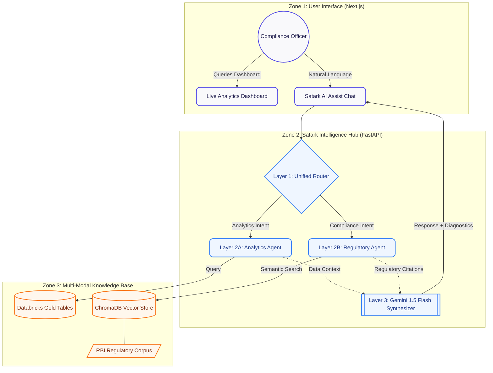

# 🛡️ SATARK: Compliance Intelligence for UPI Fraud

**SATARK** (सर्तक - *Vigilant*) is an AI-powered compliance and fraud intelligence dashboard built for the **Bharat Bricks Hackathon 2026**. It empowers Indian bank compliance officers and RBI regulators with real-time insights into over 150,000+ UPI transactions and 5,000+ regulatory complaints.


## 🚀 Overview

Satark solves the "Compliance Lag" in Indian digital payments by bridging the gap between raw transaction data and complex regulatory frameworks (RBI/NPCI). It combines a high-performance analytics dashboard with a 3-layer RAG (Retrieval-Augmented Generation) pipeline powered by **Gemini 25 Flash**.

### Key Capabilities:
- **Live Intelligence Stream**: Real-time transaction monitoring and risk scoring.
- **Scam Taxonomy Breakdown**: Identifying high-loss categories like Lottery, Investment, and Impersonation frauds.
- **Regulatory AI Assist**: A chatbot trained on 8+ RBI Master Directions to provide instant compliance citations.
- **TAT Harmonization**: Automatic tracking of turnaround times for failed transactions per RBI guidelines.

---

## 🏗️ Architecture

Satark follows a modular **3-Layer Intelligence Pipeline** grouped into functional zones for maximum reliability and scalability.



### The 3-Layer Logic:
1.  **Layer 1 (Router)**: Intelligently classifies queries into **Analytics** or **Regulatory** intents using keyword heuristics.
2.  **Layer 2 (Specialized Agents)**: 
    - **Zone A**: Accesses 5 specialized Gold tables (Geo Heatmap, Risk Distribution, Alert Effectiveness, etc.).
    - **Zone B**: Performs sub-second vector search across indexed RBI Master Directions.
3.  **Layer 3 (Synthesizer)**: Uses **Gemini 1.5 Flash** to synthesize agent metadata into a final, citation-backed response.

---

## 🛠️ Strategic Engineering Decision: Why Next.js?

While the **Bharat Bricks Hackathon** primary requirement involves Databricks, we made a strategic engineering decision to build our frontend using **Next.js** and **FastAPI** instead of native Databricks Lakehouse Apps. 

### Key Blockers for Native Databricks Frontends:
*   ❌ **Compute Dependency**: Databricks Lakehouse Apps require an active, attached cluster, which leads to significant and unnecessary cost overhead for simple visualization tasks.
*   ❌ **Limited Framework Support**: Current support is primarily focused on **Streamlit/Gradio**. While excellent for internal ML experimentation, they lack the production-grade flexibility, performance, and custom UI/UX required for a state-of-the-art compliance dashboard.
*   ❌ **Authentication & Portability**: Databricks identity management is optimized for internal organizational tools. Moving to a standalone **Vercel + Google Gemini** stack allows for a more portable, public-facing, and lightweight deployment suited for rapid regulatory intervention.

**Integrated Approach**: We still leverage **Databricks SQL Warehouses** as our core source of truth for the Gold Tables via the **Databricks SQL Connector**, ensuring we maintain the power of the Lakehouse while providing a premium, independent user experience.

---

## 🛠️ Tech Stack

- **Frontend**: Next.js 14, React, Tailwind CSS, Recharts (Modern Dashboard Aesthetics).
- **Backend**: FastAPI (Python), Uvicorn.
- **AI/ML**: Google Gemini 1.5 Flash, Sentence Transformers (All-MiniLM-L6-v2).
- **Data**: Databricks (SQL Warehouse), ChromaDB (Vector Store).
- **Compliance Source**: 8+ RBI Master Directions on UPI/Digital Payments.

---

## ⚙️ Setup & Installation

### 1. Prerequisites
- Python 3.10+
- Node.js 18+
- Gemini API Key (Google AI Studio)

### 2. Backend Setup
```bash
cd satark/backend
# Create & activate venv
python -m venv venv
.\venv\Scripts\activate

# Install dependencies
pip install -r ../../requirements.txt

# Create .env file
echo "GEMINI_API_KEY=your_key_here" > .env
```

### 3. Initialize Knowledge Base (RAG)
```bash
# Ingest RBI Documents and CSV metadata into the Vector Store
python setup_rag.py
```

### 4. Frontend Setup
```bash
cd satark
npm install
```

### 5. Running the Application
**Terminal 1 (Backend):**
```bash
cd satark/backend
python main.py
```

**Terminal 2 (Frontend):**
```bash
cd satark
npm run dev
```
The application will be live at `http://localhost:3000`.

---

## 📊 Dataset Reference
The system is primarily built on a comprehensive dataset of **150,031 transactions** spanning:
- 28 Indian States (Northeast focus for high-risk detection).
- 7 Scam Types (KYC, Investment, Job, etc.).
- 3 Risk Tiers (High, Medium, Low).
- Real-time SLA monitoring for 5,000+ complaints across major Indian banks.

---

## ⚖️ License
This project was developed for the **Bharat Bricks Hackathon 2026**. All rights reserved.