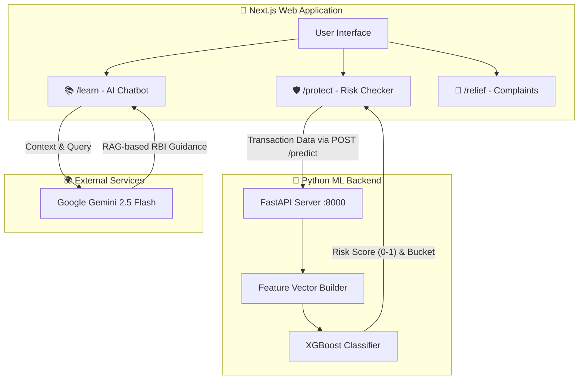

# 🛡️ SATARK: Real-Time UPI Fraud Protection

SATARK ("Alert") is an end-to-end UPI fraud detection and user protection platform. It scores UPI transactions in real-time using a trained Machine Learning model, educates users via an AI-powered RBI guidance Chatbot, and provides actionable steps for victims of fraud.

---

## 🏗️ Architecture

The platform is split into a **Next.js Frontend** (User Interface & Chatbot) and a **Python FastAPI Backend** (Machine Learning inference).



---

## 🚀 How to Run Locally

You need to run **two separate terminals** to run the complete platform. 

### Prerequisites
1. **Node.js 18+** & npm.
2. **Python 3.10+**.
3. A Gemini API Key placed in `web/.env.local` (`GEMINI_API_KEY=your_key_here`).

### Terminal 1: Start the ML Service (Port 8000)
This terminal runs the Python FastAPI service that hosts the XGBoost model.

```bash
# 1. Activate the python virtual environment
source .venv/bin/activate

# 2. Install requirements (first time only)
pip install -r requirements.txt

# 3. Enter the backend folder and start the server
cd backend/artifacts
python fraud_detector.py
```
*Wait until you see `Uvicorn running on http://0.0.0.0:8000`.*

### Terminal 2: Start the Web App (Port 3000)
This terminal runs the Next.js frontend.

```bash
# 1. Enter the web folder
cd web

# 2. Install dependencies (first time only)
npm install

# 3. Start the UI
npm run dev
```

Now open **[http://localhost:3000](http://localhost:3000)** in your browser!

---

## 🎮 Demo Steps: How to Use

Once the app is running, here is how to demo the core features:

### 1. The Risk Checker (`/protect`)
1. Navigate to the **Protect** tab.
2. Click on the pre-filled **"Demo Scenarios"** on the right side (e.g., *KYC Scam*, *Safe Transfer*, *Emergency Request*).
3. Click **"Check Risk"**. 
4. Watch the Next.js app send the data to the Python ML backend and instantly return a high/medium/low risk score dial alongside UI warnings!

### 2. The AI Chatbot (`/learn`)
1. Navigate to the **Learn** tab.
2. Scroll to the "Chat with SATARK" section.
3. Ask a question like: *"I just got scammed, my money was deducted, what should I do?"*
4. The Gemini 2.5 Flash model will use custom prompt context to guide you to call `1930` and provide official RBI guidelines.

### 3. File a Complaint (`/relief`)
1. Navigate to the **Relief** tab.
2. Go through the multi-step wizard to automatically generate a formal bank complaint letter based on your transaction details.


